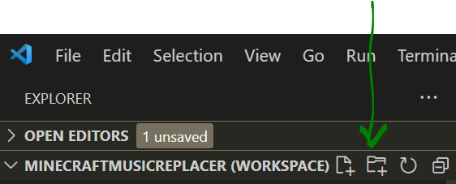
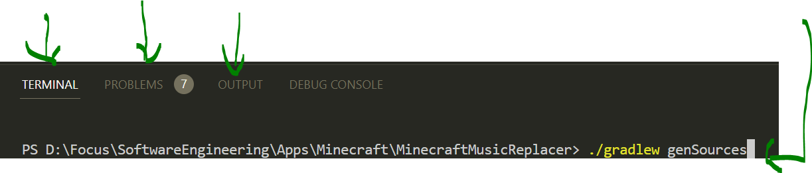

# Setup
1. Download the [Windows x64 .msi file](https://adoptium.net/temurin/releases/).

1. If applicable, choose `Custom Setup` to arrive at this screen. For the option `Set JAVA_HOME variable`, select `Entire feature will be installed on local hard drive`.

    

1. Open Visual Studio Code (VS Code).
    1. Install the following _required_ extensions:

        1. [Debugger for Java](https://marketplace.visualstudio.com/items?itemName=vscjava.vscode-java-debug)

        1. [Extension Pack for Java](https://marketplace.visualstudio.com/items?itemName=vscjava.vscode-java-pack)

        1. [Gradle for Java](https://marketplace.visualstudio.com/items?itemName=vscjava.vscode-gradle)

        1. [Language Support for Java(TM) by Red Hat](https://marketplace.visualstudio.com/items?itemName=redhat.java)

        1. [Maven for Java](https://marketplace.visualstudio.com/items?itemName=vscjava.vscode-maven)

        1. [Project Manager for Java](https://marketplace.visualstudio.com/items?itemName=vscjava.vscode-java-dependency)

        1. [Test Runner for Java](https://marketplace.visualstudio.com/items?itemName=vscjava.vscode-java-test)
    
    1. Consider installing these _recommended_ extensions:
        
        1. [Bookmarks](https://marketplace.visualstudio.com/items?itemName=alefragnani.Bookmarks)
        
        1. [Material Icon Theme](https://marketplace.visualstudio.com/items?itemName=PKief.material-icon-theme)

1. From the menu bar, which is located at the top of the VS Code window, select `File` > `Open Folder`, and select the path to the `MinecraftMusicReplacer` folder.

1. From the menu bar, select `File` > `Save Workspace As...` to save this workspace as a file called `MinecraftMusicReplacer.code-workspace`.

    - If you find yourself switching VS Code projects, then you can always return back to this project by selecting this newly created workspace file via `File` > `Open Workspace from File...`.

1. Press `CTRL+B` to toggle the left sidepane. Press `CTRL+SHIFT+X` to see your extensions. Press `CTRL+SHIFT+E` to return to your Project Explorer.

1. Create a new folder by clicking the button shown below.

    

    Name the folder: `.vscode`.

1. Right-click on the newly created `.vscode` folder and add a new file called `settings.json`.

1. Copy the following code into your `settings.json`:
    ```json
    {
        "java.project.referencedLibraries": [
            "D:\\Focus\\SoftwareEngineering\\Apps\\Minecraft\\MinecraftMusicReplacer\\lib\\slf4j-api-2.0.1.jar",
            "D:\\Focus\\SoftwareEngineering\\Apps\\Minecraft\\MinecraftMusicReplacer\\lib\\slf4j-simple-2.0.1.jar"
        ]
    }
    ```
    
    Change the folder path to accommodate your folder structure. These files were downloaded here:
    1. [slf4j-api-2.0.1.jar](https://repo1.maven.org/maven2/org/slf4j/slf4j-api/2.0.1/).

    1. [slf4j-simple-2.0.1.jar](https://repo1.maven.org/maven2/org/slf4j/slf4j-simple/2.0.1/).

1. In VS Code, open the Terminal by typing ``CTRL+` ``.

1. Under the `Terminal` tab, type `./gradlew genSources`. To view the output, click on the `Output` tab in the bottom pane.

    

    This process should take several minutes, so check back at a later time.

    As of right now, multiple unresolved problems will show up under the `Problems` tab. I will post an update once I have resolved these errors.