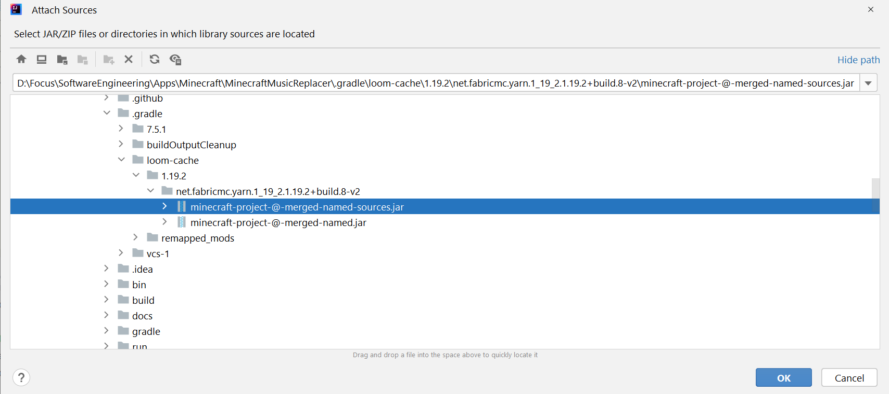

# Setup
[Click here for video instruction](https://www.youtube.com/watch?v=Xts41xvfjfs). For text instruction, proceed onwards with this guide. 

1. Download the [Windows x64 .msi file](https://adoptium.net/temurin/releases/).

   1. If applicable, choose `Custom Setup` to arrive at this screen. For the option `Set JAVA_HOME variable`, select `Entire feature will be installed on local hard drive`.

       

2. Install [IntelliJ IDEA Community](https://www.jetbrains.com/idea/download/#section=windows).

   1. When presented with installation options:
   
      1. Select `Add "bin" folder to the PATH`.

      2. Select each file extension under `Create Associations`.  

3. Open IntelliJ IDEA Community.
   1. Select `Open` to open the `MinecraftMusicReplacer` folder.
   
   2. Select `Trust Project`.
   
   3. Wait for the background processes to complete. In the meantime...
   
      1. From the menu bar, which is located at the top of the window, select `File` > `Settings...`.
      
      2. On the left-hand navigation pane, expand `Appearance & Behavior`, and select `Appearance`.
      
         1. Pick a theme that appeals to you.

      3. On the left-hand navigation pane, expand `Editor`, and select `General`.

         1. Enable soft wrapping on certain files as shown below. Soft wrapping will wrap around a long line for improved visual appearance whereas hard wrapping will separate a long line into multiple separate lines.

          

      4. On the left-hand navigation pane, expand `Editor`, and select `Font`.

         1. One suggestion is to set the font size to 20.0 and line height to 1.2 for the JetBrains Mono font.

      5. On the left-hand navigation pane, expand `Build, Execution, Deployment`, expand `Build Tools`, and select `Gradle`.
         
         1. Match these settings:
         
         
   
      6. Wait for this message to appear below: `BUILD SUCCESSFUL`.
      
         1. If this message does not appear, (1) click on `Gradle` on the right-hand navigation pane, and (2) click the `Reload All Gradle Projects` button.

         

4. Open the `Terminal` tab below and type in: `./gradlew genSources`. Wait up to 5 minutes for the message `BUILD SUCCESSFUL` to appear.
   
5. On the left navigation pane under the `Projects` tab, scroll down to expand `External Libraries`.
   
   1. Scroll down to expand `Gradle: net.minecraft:minecraft-project`.
         
      1. Open any file from any directory underneath `net.minecraft`.
         
         1. These are the Minecraft source code files. After opening any file, a banner at the top of the code editor should appear with a message that is similar to this message: `Decompiled .class file, bytecode version 61.0 (Java 17)`.
            
      2. Select `Choose Sources...` and select the `.jar` file ending with `-sources` as such:

         
   
         The file should reload automatically, and the banner should disappear.
   
6. On the right-hand navigation pane, select the `Gradle` tab.

   1. Expand `Tasks` > `fabric`. Then double-click `runClient`. A Minecraft launcher should pop up several minutes afterwards.